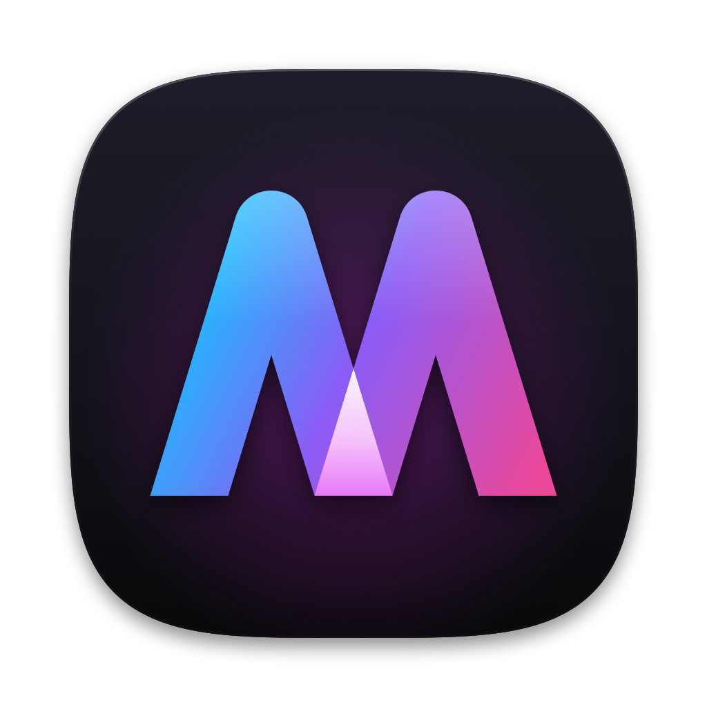

<div align="center">



# MacNative

**Play the Windows games you own on Steam and GOG on your Mac. One app, no setup hell.**

No bottles to manage, no Wine config files, no Steam client required.

[](LICENSE)


[](https://github.com/sivikee/macnative/releases)

### [⬇️ Download MacNative for macOS](https://github.com/sivikee/macnative/releases)

<sub>Apple Silicon · macOS 14+ · free & open source</sub>

</div>

---

MacNative is a native SwiftUI game launcher for Apple Silicon Macs. Sign in to Steam or GOG, press **Install**, then press **Play**. Under the hood it handles Wine, DirectX translation, prefixes and Steam emulation, the same way [GameNative](https://github.com/utkarshdalal/GameNative) does on Android. MacNative is built in its spirit and borrows its look.

> **Status: early (v0.1).** Many games already run, many don't yet. Expect rough edges, and please report what you find.

## Features

### 🎮 Your libraries, natively
- **Steam, with no Steam client.** Sign in with your password plus Steam Guard, or scan a QR code with the Steam mobile app. MacNative fetches your owned games straight from Steam and downloads them from Steam's CDN, with resumable, verified, parallel downloads. It then launches them with Steamworks emulation, so games that expect Steam still start.
- **GOG.** Sign in and install any Windows game you own with one click, with no Galaxy client. Installers that crash on modern Wine are retried automatically with a compatibility engine.
- **Custom games.** Add any Windows `.exe`. Artwork is matched automatically.

### ⚡️ DirectX on Apple Silicon
| Backend | Translates | Best for |
|---|---|---|
| **WineD3D** | DirectX 9 and older → OpenGL | Older and 32-bit games |
| **DXVK** | DirectX 10/11 → Vulkan → Metal (MoltenVK) | Most DX11 games |
| **DXMT** | DirectX 10/11 → Metal | Often the fastest DX11 path (experimental) |
| **D3DMetal** | DirectX 11/12 → Metal (Apple's Game Porting Toolkit) | **DirectX 12** and modern 64-bit games |

Pick a backend per game. Everything a backend needs is downloaded the first time a game uses it. Picking D3DMetal for a 32-bit game falls back to WineD3D automatically.

### 🕹️ Controller-first
Xbox, PlayStation (DualShock 4 / DualSense), Switch Pro and MFi controllers work **in the launcher's menus**, through Apple's GameController framework:

| Button | Action |
|---|---|
| A / Cross | Open / Play |
| B / Circle | Back |
| X / Square | Favorite |
| Y / Triangle | Search |
| LB / RB | Switch tabs |
| Menu / Options | Settings |

**In games**, controllers show up as standard XInput pads through Wine's SDL support. Keyboard navigation works too: arrows, Return, Esc, Q/E.

### 🧰 Settings without the Wine homework
Every game has simple settings, modelled on GameNative's container settings:
- graphics backend, Wine engine and Windows version
- Retina mode, virtual desktop, ⌘ as Ctrl
- MSync / ESync, AVX for Rosetta
- FPS cap, DXVK and Metal HUDs
- the executable and launch arguments, DLL overrides and environment variables

There are no config files to edit.

### ✅ Compatibility database
[`compat/games.json`](compat/games.json) is a community-maintained list of how games run: **Works / Playable / Broken**, with notes and known-good settings. MacNative downloads the latest version, shows a badge on each game, and applies recommended settings automatically unless you've changed that game's settings. Use game page → ⋯ → **Report compatibility…** to open a pre-filled report, or edit the file in a pull request (see [compat/README.md](compat/README.md)).

### 📦 Self-contained
Everything MacNative creates lives in **one folder**: engines, game prefixes, downloads, Steam libraries, logs, caches and sign-ins. Nothing is installed system-wide. The only exception is Apple's Rosetta 2, which MacNative offers to install through macOS's own installer. **Settings → System → Erase everything** removes it all in one click.

## How it works

```
             ┌──────────────── MacNative (SwiftUI) ────────────────┐
  Steam ───▶ │ Swift Steam client: login, PICS library, CDN depots │
  GOG   ───▶ │ GOG API + silent offline installers                 │
             └───────────────────────┬─────────────────────────────┘
                                     ▼
            gbe_fork steamclient (Steamworks emulation, Steam games)
                                     ▼
                    Wine (Gcenx macOS builds) under Rosetta 2
                                     ▼
          WineD3D │ DXVK + MoltenVK │ DXMT │ D3DMetal (GPTK Wine)
                                     ▼
                                   Metal
```

- **Steam** is a from-scratch, dependency-free Swift implementation. It handles the WebSocket CM connection, hand-written protobuf, `IAuthenticationService` login, licenses and PICS, depot keys, manifest request codes, and CDN chunk download, decryption (AES), decompression (LZMA / zstd / zip) and Adler-32 verification. Games launch through [gbe_fork](https://github.com/Detanup01/gbe_fork)'s ColdClientLoader, set up with your real account ID, owned DLC and an encrypted app ticket from Steam. **Steam Cloud** saves sync automatically: newer saves are downloaded before you play, and changes are uploaded when you quit.
- **Wine** comes from [Gcenx's macOS builds](https://github.com/Gcenx/macOS_Wine_builds), which bundle MoltenVK and SDL2. **D3DMetal** uses [Gcenx's Game Porting Toolkit Wine](https://github.com/Gcenx/game-porting-toolkit), the build Apple's own GPTK Read Me points to. You can import a newer D3DMetal from Apple's GPTK download in Settings → Engines.
- **Engine variants** for DXMT and an imported D3DMetal are APFS clones of the base engine. They're instant and take no extra disk space.

### Why not Proton?
Proton is Valve's bundle of Wine, DXVK and VKD3D-Proton for **Linux**, and its binaries don't run on macOS. MacNative uses the same building blocks where macOS can run them: Wine and DXVK (the macOS fork). For DirectX 12 it uses Apple's D3DMetal, because VKD3D-Proton needs Vulkan features that MoltenVK doesn't provide.

## Getting started

### Download (recommended)

1. Grab **MacNative-x.y.z-macOS-arm64.zip** from [**Releases**](https://github.com/sivikee/macnative/releases), unzip it, and move **MacNative.app** to Applications.
2. Builds are ad-hoc signed and not notarized yet, so macOS asks once:
   - **macOS 15 and newer:** open the app, then go to **System Settings → Privacy & Security** and click **Open Anyway**.
   - **macOS 14:** right-click the app and choose **Open**.
3. Follow the first-run checklist. MacNative checks GitHub for new versions on launch and updates itself in one click.

**Requirements:** an Apple Silicon Mac with macOS 14 or newer.

### Build from source

You also need the Xcode command line tools.

```sh
git clone https://github.com/sivikee/macnative.git
cd macnative
scripts/build.sh            # dev build: everything stays in ./data inside the repo
open build/MacNative.app
```

A first-run checklist installs Rosetta 2 if needed, downloads a Wine engine (~190 MB), and connects your stores.

| Command | What it does |
|---|---|
| `scripts/build.sh` | Dev build. App data lives in `./data` (gitignored). |
| `scripts/build.sh --release` | Release build. Data lives in `~/Library/Application Support/MacNative`. |
| `swift test` | Unit tests: protobuf, VDF, ZIP, VZip/LZMA, checksums. |
| `scripts/make-icon.sh` | Regenerates the app icon from its CoreGraphics source. |

Set `MACNATIVE_HOME=/some/folder` to put the data folder anywhere you like.

## Using it

- **Steam:** Settings → Accounts → Steam → **Sign in**. Your owned Windows games appear under the Steam tab. **Install** downloads directly from Steam, and **Play** launches without the client. For games with heavy DRM or anti-cheat, turn on **Use the Windows Steam client** in that game's settings.
- **GOG:** Settings → Accounts → GOG → **Sign in**, then **Install** any game.
- **DirectX 12:** in a game's settings, set Graphics to **D3DMetal**. The first launch downloads what it needs.
- **When a game won't start:** use the game page ⋯ → **Open log**. Try another graphics backend, Windows version, or launch option (⚙︎ → Launch).

## Roadmap

- [x] Steam: native login, library, downloads, launching via gbe_fork
- [x] GOG: login, library, silent installs with compatibility fallback
- [x] WineD3D / DXVK / DXMT / D3DMetal, per-game settings, controller navigation
- [x] Steam Cloud saves (download before play, upload after quitting)
- [ ] Steam achievement sync
- [ ] Steam game updates, beta branches, file verification, shared redistributables
- [ ] GOG cloud saves; downloading GOG games through Galaxy's content system instead of installers
- [x] Compatibility database: per-game status badges and known-good configs applied automatically
- [ ] Controller navigation inside settings screens
- [ ] Epic Games
- [x] In-app updates from GitHub Releases
- [ ] Signed and notarized releases

## Project layout

```
Sources/
  MacNative/
    App/           App entry, AppState (library, installs, launching), SteamStore, navigation, controller input
    Core/          Models (Game, GameConfig…) and Paths (the single data root)
    Services/      EngineManager, WineRunner, GOGService, downloads, VDF…
      Steam/       Swift Steam client: connection, auth, PICS, CDN, depot chunks, installer, gbe_fork launcher
    UI/            Theme, Library, Game page, Settings, Setup
  CLzma/           Vendored LZMA SDK decoder (public domain)
  CZstd/           Vendored zstd single-file decoder (BSD)
Tests/             Unit tests
Resources/         App icon and logo sources
scripts/           build.sh, make-icon.sh
```

## Contributing

Issues and pull requests are welcome. Game compatibility reports help most: say which game, which store, which graphics backend, and attach the log. Please keep the project self-contained: no system-wide installs, and new runtime pieces downloaded into the data folder.

## Legal

MacNative only downloads and runs games **your account owns**. It verifies ownership with Steam and GOG and passes Steam's own ownership ticket to games. It does not include or distribute any game, DRM-circumvention tool or proprietary Apple, Valve or Microsoft binary.

- **Downloaded on demand from their official sources:** Wine, DXVK, DXMT, MoltenVK, gbe_fork, and Apple's D3DMetal (via Gcenx's GPTK build, or your own copy from Apple). Each keeps its own license.
- **GOG sign-in:** uses GOG Galaxy's public client credentials, the same ones Heroic, Lutris and GameNative use.

Not affiliated with Valve, GOG, Apple, CodeWeavers or the GameNative project. Steam and GOG are trademarks of their respective owners.

## Credits & licenses

MacNative is licensed under the **GNU GPL v3.0** (see [LICENSE](LICENSE)).

| Component | Role | License |
|---|---|---|
| [GameNative](https://github.com/utkarshdalal/GameNative) | Design language and settings model; the inspiration | GPL-3.0 |
| [Wine](https://www.winehq.org) via [Gcenx's builds](https://github.com/Gcenx/macOS_Wine_builds) | Windows compatibility layer | LGPL-2.1+ |
| [DXVK-macOS](https://github.com/Gcenx/DXVK-macOS) | Direct3D 10/11 → Vulkan | zlib |
| [DXMT](https://github.com/3Shain/dxmt) | Direct3D 10/11 → Metal | zlib |
| [MoltenVK](https://github.com/KhronosGroup/MoltenVK) | Vulkan → Metal | Apache-2.0 |
| [gbe_fork](https://github.com/Detanup01/gbe_fork) | Steamworks emulation for client-free launching | LGPL-3.0 |
| [Game Porting Toolkit](https://developer.apple.com/games/game-porting-toolkit/) (D3DMetal) | Direct3D 11/12 → Metal | Apple license |
| [LZMA SDK](https://7-zip.org/sdk.html) | Steam chunk decompression | Public domain |
| [zstd](https://github.com/facebook/zstd) | Steam chunk decompression | BSD |
| [Bricolage Grotesque](https://github.com/ateliertriay/bricolage) | Typeface | SIL OFL 1.1 |
| [SteamKit2](https://github.com/SteamRE/SteamKit) & [SteamDatabase/Protobufs](https://github.com/SteamDatabase/Protobufs) | Protocol reference | LGPL-2.1 / reference |
